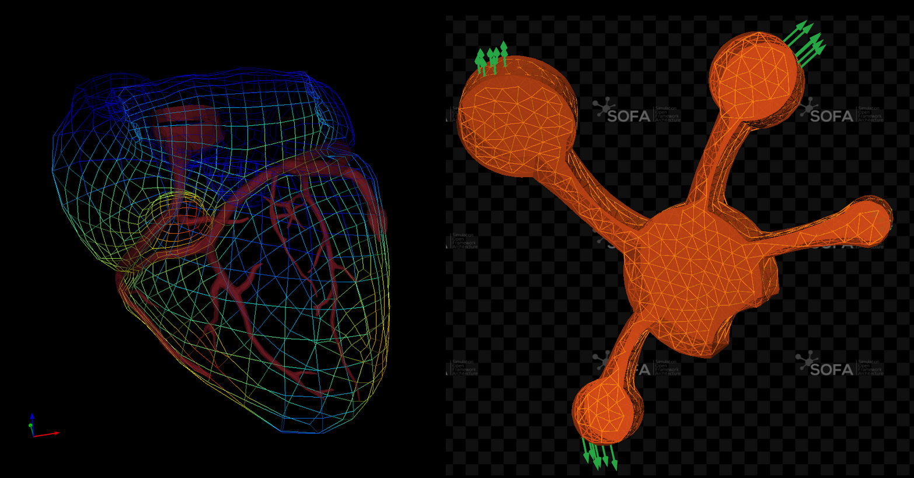

# SimRender

A **Python** library for **3D interactive rendering** of **numerical simulations**.


## Presentation

**SimRender** is a Python module for creating **3D renderings** of **numerical simulations** in a **very few lines of 
code**.

The main feature is that users can launch an **interactive 3D rendering window without blocking** the execution of the 
python process.

The Core of this project is **compatible with any numerical simulation** written in Python and provides the 
following list of features.
**Additional cool features** are also available for [**SOFA**](https://www.sofa-framework.org/) **numerical 
simulations**.

See more on the project [**documentation**]().


## Gallery



## Features

Core features
* a **simple API** to create and update visual objects from simulated data;
* several **customizable visual objects**: meshes, point clouds, arrows;
* several available **viewers**:
  * `Viewer`: a simple rendering window to render the current state of a **single** numerical simulation;
  * `ViewerBatch`: an advanced rendering window to render the current state of **several** numerical simulations 
    **simultaneously**;
  * `Player`: an advanced rendering window to **navigate** through the numerical simulation **time steps** (play/pause, 
    back/forth).

Additional SOFA features
* an enhanced API to **update** visual objects **automatically** with Data callbacks;
* an option to **render** the numerical simulation **completely automatically** given the **scene graph**;
* an enhanced `Player` to **select** the **displayed models**.

See more on the project [**documentation**]().


## Install

``` bash
# Option 1 (USERS): install with pip
$ pip install git+https://github.com/RobinEnjalbert/SimRender.git

# Option 2 (DEVS): install as editable
$ git clone https://github.com/RobinEnjalbert/SimRender.git
$ cd SimRender
$ pip install -e .
```

See more on the project [**documentation**]().


## Documentation

Just in case you missed it ⟶ [**documentation**]()
